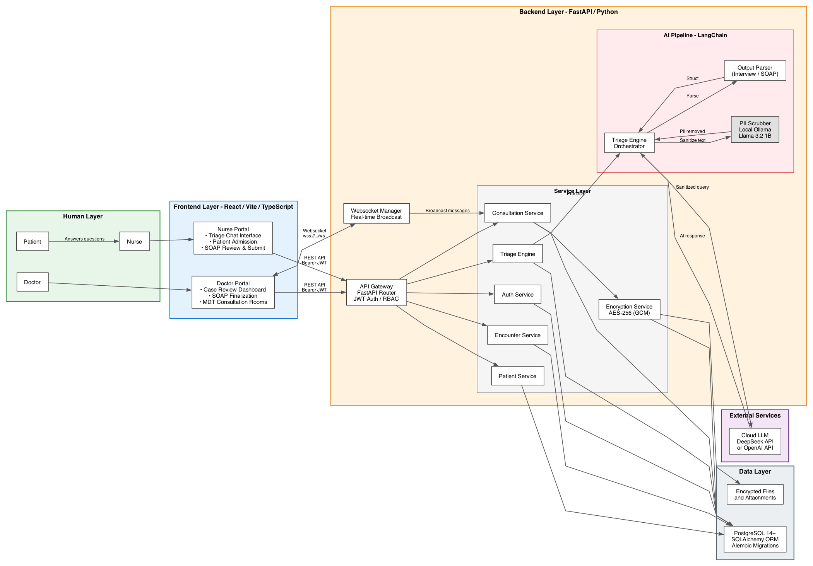
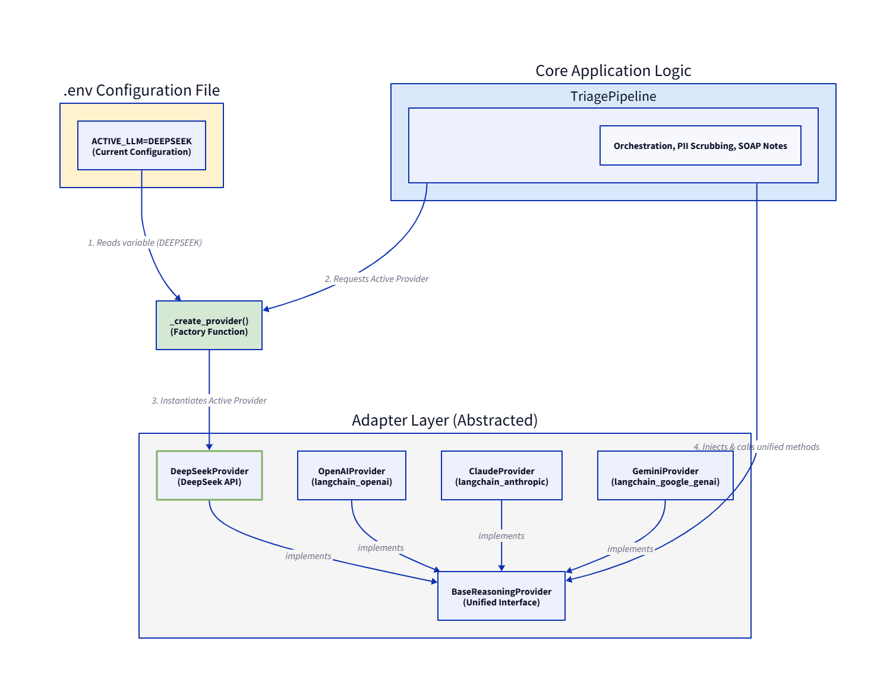

[comment]: # "This is the standard layout for the project, but you can clean this and use your own template, and add more information required for your own project"

<!-- Once you fill the index.json file inside /docs/data, please make sure the syntax is correct. (You can use this tool to identify syntax errors)

Please include the "correct" email address of your supervisors. (You can find them from https://people.ce.pdn.ac.lk/ )

Please include an appropriate cover page image ( cover_page.jpg ) and a thumbnail image ( thumbnail.jpg ) in the same folder as the index.json (i.e., /docs/data ). The cover page image must be cropped to 940×352 and the thumbnail image must be cropped to 640×360 . Use https://croppola.com/ for cropping and https://squoosh.app/ to reduce the file size.

If your followed all the given instructions correctly, your repository will be automatically added to the department's project web site (Update daily)

A HTML template integrated with the given GitHub repository templates, based on github.com/cepdnaclk/eYY-project-theme . If you like to remove this default theme and make your own web page, you can remove the file, docs/_config.yml and create the site using HTML. -->

# MediTriage — AI-Powered Pre-Consultation Triage System

---

## Team
-  E/22/044, D.M.N.N. Bandara, [e22044@eng.pdn.ac.lk](mailto:e22044@eng.pdn.ac.lk)
-  E/22/102, A.K. Gamage, [e22102@eng.pdn.ac.lk](mailto:e22102@eng.pdn.ac.lk)
-  E/22/010, A.A.D.I. Adikari, [e22010@eng.pdn.ac.lk](mailto:e22010@eng.pdn.ac.lk)
-  E/22/211, H.M. Liyanage, [e22211@eng.pdn.ac.lk](mailto:e22211@eng.pdn.ac.lk)

<!-- Image (photo/drawing of the final hardware) should be here -->

<!-- This is a sample image, to show how to add images to your page. To learn more options, please refer [this](https://projects.ce.pdn.ac.lk/docs/faq/how-to-add-an-image/) -->

<!--  -->

#### Table of Contents
1. [Introduction](#introduction)
2. [Solution Architecture](#solution-architecture)
3. [Software Designs](#software-designs)
4. [Testing](#testing)
5. [Conclusion](#conclusion)
6. [Links](#links)

## Introduction

Outpatient Departments (OPD) and Wards face significant bottlenecks because doctors spend the initial 5–10 minutes of every consultation gathering basic patient history. This reduces the time available for actual diagnosis and treatment, increases patient waiting times, and places unnecessary cognitive load on clinical staff.

**MediTriage** is an AI-powered, staff-assisted pre-consultation tool designed to streamline the clinical intake process in hospital settings. It empowers hospital staff (e.g., nurses) to conduct structured patient interviews efficiently using an AI-guided conversational interface. The system allows the nurse to capture and verify patient responses before the conversation is automatically converted into a draft **SOAP Note** (Subjective, Objective, Assessment, Plan) — a structured medical summary ready for the attending doctor.

### Key Capabilities

- **🤖 Conversational AI Triage** — A LangChain-powered interview engine guides the nurse through a clinically structured question flow, adapting dynamically to patient responses.
- **🔒 Privacy-First Architecture** — Patient Identifiable Information (PII) is scrubbed locally using a lightweight Llama 3.2 model (via Ollama) *before* any data is sent to a cloud AI provider, ensuring patient data never leaves the facility unprotected.
- **📝 Automated SOAP Note Generation** — Cloud AI synthesises the scrubbed conversation into a structured clinical note for doctor review.
- **💬 Real-Time MDT Conferences** — Secure real-time collaboration rooms for Multi-Disciplinary Teams (MDT) of doctors to discuss clinical cases, share encrypted messages, and collaborate on attachments.
- **👥 Role-Based Access Control** — Dedicated portals and permissions for Nurses, Doctors, and Administrators.

## Solution Architecture

The system follows a **layered architecture** separating human interaction, frontend presentation, backend processing, and data/AI services.

<!-- This is a sample image, to show how to add images to your page. To learn more options, please refer [this](https://projects.ce.pdn.ac.lk/docs/faq/how-to-add-an-image/) -->

<div class="figure container">

<p class="caption text-center">Figure 1 — MediTriage System Architecture</p>
</div>

### Layer Overview

| Layer | Components | Description |
|---|---|---|
| **Human Layer** | Patient, Doctor, Nurse | End-users who interact with the system. The nurse conducts the AI-guided interview; the doctor reviews generated SOAP notes and collaborates in MDT rooms. |
| **Frontend (React)** | Doctor Portal, Nurse App | Role-specific React (Vite) single-page applications. The Nurse App drives the triage interview; the Doctor Portal provides SOAP note review, annotation, and MDT conference rooms. |
| **Backend (FastAPI)** | API Gateway, Service Layer, AI Pipeline, Websocket Manager | A Python FastAPI service exposing REST and WebSocket endpoints. Core services manage users, patients, encounters, real-time chat broadcast, and AES-256 GCM encryption. The LangChain AI pipeline orchestrates sanitisation, reasoning, and output parsing. |
| **External Services** | Cloud LLM | Cloud AI applications (DeepSeek API or OpenAI API) are used for high-quality clinical reasoning and SOAP note generation. |
| **Local Scrubber** | Llama 3.2 (Ollama) | A locally-hosted LLM that strips PII from the patient conversation before any data reaches cloud services. |
| **Data Layer** | PostgreSQL, Encrypted File Storage | Persistent storage for patient records, user accounts, triage sessions, and messages in PostgreSQL managed via SQLAlchemy ORM. Secure storage for uploaded attachments. |

### Data Flow

#### Triage Pipeline Data Flow

1. The **Nurse** admits a patient and begins an AI-guided interview in the **Nurse App**.
2. Text input is sent to the **FastAPI Backend** via the **API Gateway**.
3. The **Triage Engine Orchestrator** in the **AI Pipeline** passes the raw conversation text to the **PII Scrubber** to sanitize patient identifiable information using local Ollama (Llama 3.2 1B).
4. The sanitized query is forwarded to the **Cloud LLM (DeepSeek or OpenAI)** for clinical reasoning.
5. The AI response is returned to the nurse for verification and stored in **PostgreSQL**.
6. On completion, a draft **SOAP Note** is generated and surfaced in the **Doctor Portal** for review and annotation.

#### MDT Conferences Data Flow

1. A **Doctor** reviews case records in the **Doctor Portal** and initiates an **MDT Consultation Room** for collaborative discussion, specifying a title and selecting other attending doctors.
2. The room creation request is sent via REST API to the **API Gateway**, where the **Consultation Service** creates the room in the **Data Layer (PostgreSQL)**.
3. Doctors join the conference, establishing real-time communication channels through the **Websocket Manager** (`wss://.../ws`).
4. Messages typed in the consultation room are encrypted dynamically using AES-256 (Fernet) via the **Encryption Service** before database insertion.
5. Collaborative attachments uploaded by doctors are encrypted by the **Encryption Service** and stored securely in the file storage data layer, with references stored in PostgreSQL.
6. The **Websocket Manager** broadcasts new messages and attachment notifications in real time to all connected members in the room.


## Software Designs

### Technology Stack

#### Backend (`meditriage-be`)

| Category | Technology |
|---|---|
| **Framework** | FastAPI 0.104+ |
| **Language** | Python 3.10+ |
| **Database** | PostgreSQL 14+ with SQLAlchemy ORM |
| **Migrations** | Alembic |
| **AI / LLM Orchestration** | LangChain |
| **Local LLM (PII Scrubbing)** | Ollama + Llama 3.2 1B |
| **Cloud LLM (Reasoning)** | OpenAI API or DeepSeek API |
| **Authentication** | JWT (python-jose) + bcrypt |
| **Validation** | Pydantic v2 |
| **Server** | Uvicorn (ASGI) |
| **Encryption** | cryptography (AES-256 Fernet) |
| **Real-time Communication** | FastAPI WebSockets |

#### Frontend (`meditriage-fe`)

| Category | Technology |
|---|---|
| **Framework** | React 19 |
| **Build Tool** | Vite 7 |
| **Language** | TypeScript / JavaScript (ES6+) |
| **State Management** | Zustand |
| **HTTP Client** | Axios |
| **Linting** | ESLint 9 |
| **Real-time Communication** | Native WebSocket API |

### Backend Project Structure

```
meditriage-be/
├── app/
│   ├── api/v1/
│   │   ├── controllers/       # Route handlers (auth, patients, triage, users, consultations)
│   │   └── dependencies.py    # RBAC & JWT injection
│   ├── core/                  # Config, security, logging, connection_manager.py
│   ├── db/                    # SQLAlchemy session
│   ├── models/                # ORM models (Patient, User, Encounter, consultation, …)
│   ├── repositories/          # Data access layer (consultation_repo, etc.)
│   ├── schemas/               # Pydantic request/response schemas
│   ├── services/
│   │   ├── llm/               # LangChain chains, prompts, parser, and adapters
│   │   ├── triage_engine.py   # Core triage orchestration
│   │   ├── consultation_service.py # MDT room business logic
│   │   ├── encryption_service.py # AES-256 encryption helper
│   │   └── …                  # Auth, patient, encounter services
│   └── main.py
├── alembic/                   # Database migrations
├── tests/                     # Pytest test suite
└── requirements.txt
```

### LLM Adapter Design (Adapter Pattern)

To prevent vendor lock-in and allow seamless switching between different cloud AI models, the backend implements the **Adapter Pattern** at the LLM integration layer.

<div class="figure container">

<p class="caption text-center">Figure 2 — MediTriage LLM Adapter Design</p>
</div>

#### Key Components:
- **BaseReasoningProvider ([base_provider.py](../code/meditriage-be/app/services/llm/providers/base_provider.py))**: An abstract base class defining a unified interface (`generate_response`, `generate_structured_output`) for all reasoning providers.
- **Provider Implementations**:
  - **DeepSeekProvider ([deepseek_provider.py](../code/meditriage-be/app/services/llm/providers/deepseek_provider.py))**: Integrates DeepSeek's model through LangChain's OpenAI compatibility interface.
  - **OpenAIProvider ([openai_provider.py](../code/meditriage-be/app/services/llm/providers/openai_provider.py))**: Direct OpenAI integration through LangChain.
  - *ClaudeProvider / GeminiProvider*: Supported by design via the unified `BaseReasoningProvider` interface.
- **Dynamic Factory Configuration ([chain_factory.py](../code/meditriage-be/app/services/llm/chain_factory.py))**: The `_create_provider()` factory function reads the `ACTIVE_LLM` setting from the `.env` configuration file to instantiate the selected provider dynamically.
- **Loose Coupling**: The `TriagePipeline` requests the active provider from the factory and invokes methods declared in the base interface, decoupling core orchestration logic from vendor-specific libraries.

### API Endpoints Summary

| Category | Endpoint | Method | Role |
|---|---|---|---|
| **Auth** | `/api/v1/auth/register` | POST | Public |
| | `/api/v1/auth/login` | POST | Public |
| | `/api/v1/auth/me` | GET / PATCH | All |
| **Patients** | `/api/v1/patients` | POST | Nurse, Admin |
| | `/api/v1/patients/search` | GET | Nurse, Doctor |
| | `/api/v1/patients/{id}` | GET / PUT / DELETE | Nurse, Doctor, Admin |
| | `/api/v1/patients/{id}/history` | GET | Nurse, Doctor |
| **Triage** | `/api/v1/triage/start` | POST | Nurse |
| | `/api/v1/triage/chat` | POST | Nurse |
| | `/api/v1/triage/{id}/messages` | GET | Nurse, Doctor |
| | `/api/v1/triage/{id}/note` | GET / PUT | Nurse, Doctor |
| **MDT** | `/api/v1/consultations/rooms` | POST | Doctor |
| | `/api/v1/consultations/rooms` | GET | Doctor |
| | `/api/v1/consultations/rooms/{room_id}` | GET | Doctor |
| | `/api/v1/consultations/rooms/{room_id}/members` | POST | Doctor |
| | `/api/v1/consultations/rooms/{room_id}/members/{doctor_id}` | DELETE | Doctor (Creator) |
| | `/api/v1/consultations/rooms/{room_id}/close` | PATCH | Doctor (Creator) |
| | `/api/v1/consultations/rooms/{room_id}/messages` | GET | Doctor |
| | `/api/v1/consultations/rooms/{room_id}/attachments` | POST | Doctor |
| | `/api/v1/consultations/rooms/{room_id}/attachments/{attachment_id}` | GET | Doctor |
| | `/api/v1/consultations/rooms/{room_id}/ws` | WebSocket | Doctor |
| **Users** | `/api/v1/users` | GET / DELETE | Admin |


## Testing

The project uses **Pytest** for backend testing, with the test suite located in `meditriage-be/tests/`.

### Test Layers

| Layer | Scope | Tools |
|---|---|---|
| **Unit Tests** | Individual service functions, LLM prompt logic, RBAC rules | `pytest`, `unittest.mock` |
| **Integration Tests** | API endpoint request/response cycles against a test database | `pytest`, `TestClient` (FastAPI) |
| **Manual / Postman** | End-to-end workflow validation (register → admit → triage → SOAP note) | Postman collection (`postman/`) |


## Conclusion

MediTriage demonstrates how **AI-assisted clinical workflows** can meaningfully reduce the administrative burden on healthcare professionals. By automating the initial patient history-gathering process through a conversational AI interface — while keeping patient privacy at the forefront through local PII scrubbing — the system frees doctors to focus on diagnosis and treatment rather than data collection.

Key outcomes of the project:

- A fully functional triage pipeline from patient admission to SOAP note delivery, validated end-to-end.
- A secure, real-time collaboration environment (MDT Conferences) allowing Multi-Disciplinary Teams of doctors to collaborate on cases, share encrypted messages, and upload sensitive medical files.
- A privacy-preserving AI architecture where sensitive data is sanitised before any cloud interaction, and end-to-end AES-256 encryption is applied to clinical consultation data.
- A role-aware web application that adapts its interface and permissions to the specific needs of Nurses, Doctors, and Administrators.
- A modular, maintainable codebase built on industry-standard frameworks (FastAPI, React, LangChain, PostgreSQL) that can be extended to support additional clinical workflows.

Future work could include integration with hospital information systems (HIS/EMR), support for multilingual patient interaction, and deployment within a containerised (Docker/Kubernetes) hospital infrastructure.


## Links

- [Project Repository](https://github.com/cepdnaclk/{{ page.repository-name }}){:target="_blank"}
- [Project Page](https://cepdnaclk.github.io/{{ page.repository-name}}){:target="_blank"}
- [Department of Computer Engineering](http://www.ce.pdn.ac.lk/)
- [University of Peradeniya](https://eng.pdn.ac.lk/)

[//]: # (Please refer this to learn more about Markdown syntax)
[//]: # (https://github.com/adam-p/markdown-here/wiki/Markdown-Cheatsheet)
